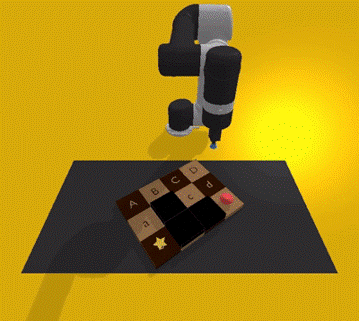
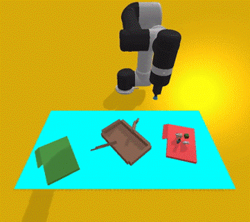
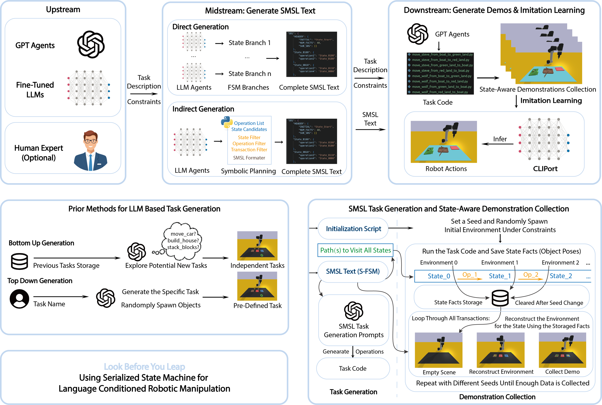
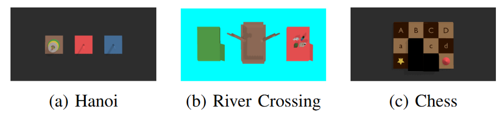

# imitate

| Chess | Hanoi | River |
| --- | --- | --- |
|  |  |  |

## Packages

- `smsl_generation/`: generates scenario-specific SMSL JSON artifacts.
- `smsl_gensim/`: provides the GenSim and CLIPort simulation backend for task generation, demonstration collection, policy training, and evaluation.

## SMSL Generation Environment

Create the SMSL generation environment:

```bash
conda create -n smsl-generation python=3.11 -y
conda activate smsl-generation
pip install -r smsl_generation/requirements.txt
cp smsl_generation/.env.example smsl_generation/.env
```

Set the API keys you plan to use in `smsl_generation/.env`:

```bash
OPENAI_API_KEY=YOUR_KEY
GEMINI_API_KEY=YOUR_KEY
ANTHROPIC_API_KEY=YOUR_KEY
```

## SMSL GenSim Environment

Create the SMSL GenSim environment:

```bash
cd smsl_gensim
conda create -n smsl-gensim python=3.8 -y
conda activate smsl-gensim
pip install --upgrade pip
pip install -r requirements.txt
python setup.py develop
cp .env.example .env
export GENSIM_ROOT="$(pwd)"
cd ..
```

Set the OpenAI key in `smsl_gensim/.env`:

```bash
OPENAI_API_KEY=YOUR_KEY
```

Inspect the included SMSL scenarios and primitive task assets:

```bash
cd smsl_gensim
python -m smsl_gensim list
python -m smsl_gensim generate-tasks hanoi --backend llm
python -m smsl_gensim check-tasks hanoi
python -m smsl_gensim check-scenes hanoi
python -m smsl_gensim demos-plan hanoi
python -m smsl_gensim status hanoi
python -m smsl_gensim collect-demos hanoi --n 1 --mode train
python -m smsl_gensim check-data hanoi --n 1 --mode train
python -m smsl_gensim collect-missing hanoi --n 1 --mode train
python -m smsl_gensim merge-data hanoi --mode train
python -m smsl_gensim train-operation hanoi move-gray-hanoi-ring-to-the-center-of-blue-hanoi-stand
python -m smsl_gensim train-scenario hanoi
python -m smsl_gensim eval-operation hanoi move-gray-hanoi-ring-to-the-center-of-blue-hanoi-stand
python -m smsl_gensim eval-scenario hanoi
python -m smsl_gensim collect-one hanoi --from-state State_aaa --operation move_gray_hanoi_ring_to_the_center_of_blue_hanoi_stand
cd ..
```





## Citation

If you find this work useful, please consider citing:

```bibtex
@inproceedings{mu2025look,
  title={Look before you leap: Using serialized state machine for language conditioned robotic manipulation},
  author={Mu, Tong and Liu, Yihao and Armand, Mehran},
  booktitle={2025 IEEE/RSJ International Conference on Intelligent Robots and Systems (IROS)},
  pages={8096--8102},
  year={2025},
  organization={IEEE}
}
```
